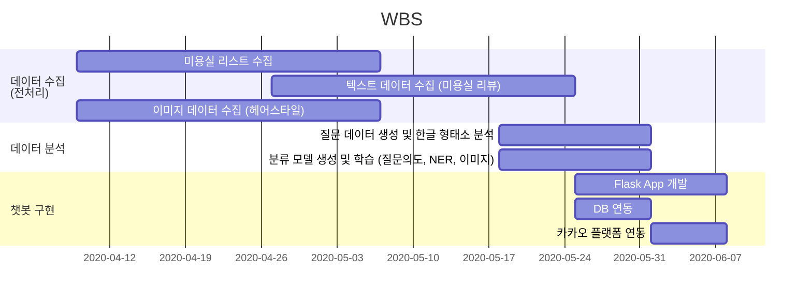

# Mary Talk
서울시 소재 미용실 및 헤어스타일 추천 챗봇

# Overview
본 프로젝트(Mary Talk) 의 목차는 다음과 같습니다.
- [Overview](#overview)
- [프로젝트 목표](#프로젝트-목표)
- [개발 일정](#개발-일정)
- [서비스 사용 샘플](#서비스-사용-샘플)

# 프로젝트 목표
프로젝트 목표 : 서울시에 소재한 미용실에 대한 추천 및 질문답변을 제공하는 챗봇 제작
1. 대화형 헤어샵 추천 서비스
   - 위생 / 서비스 / 분위기 / 위치 / 헤어 관련 만족도 / 기타 총 6개 평가 항목에 대한 자체 Rating System 구축
   - Rating 에 기반한 미용실 추천 기능
2. 미용실 관련 문의사항에 대한 맞춤 답변 제공
   - 위치, 후기, 가격 문의에 대한 상담 기능
3. 사진 검색을 통한 헤어스타일 정보 제공
   - 사용자가 전송한 사진에 해당하는 헤어스타일 정보 제공
   - 추후 해당 헤어스타일에 특화된 미용실 추천으로 서비스 연계 가능

# 개발 일정
2020.04.09. ~ 2020.06.08.

# 서비스 사용 샘플

