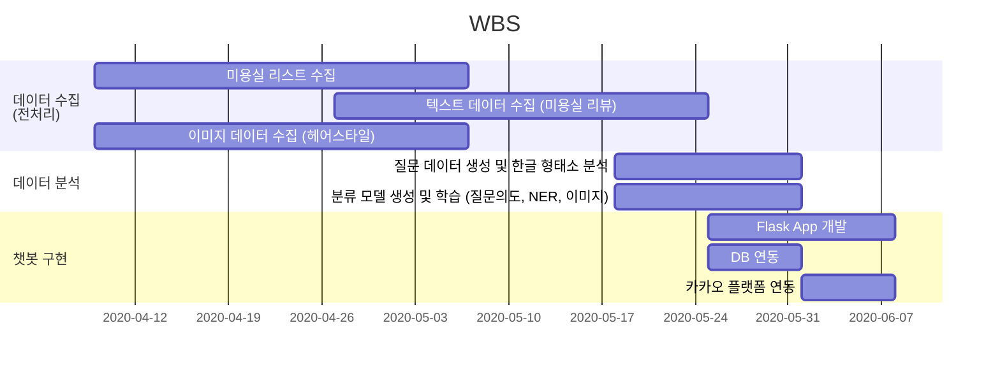
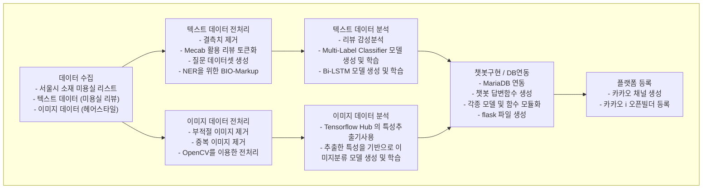

# Mary Talk
서울시 소재 미용실 및 헤어스타일 추천 챗봇

# Overview
본 프로젝트(Mary Talk) 의 목차는 다음과 같습니다.
- [Overview](#overview)
- [프로젝트 목표](#프로젝트-목표)
- [개발 일정](#개발-일정)
- [Work Flow](#work-flow)
- [개발 환경](#개발-환경)
- [개발 과정](#개발-과정)
  - [1. 데이터 수집](#1-데이터-수집)
  - [2. 리뷰 감성분석](#2-리뷰-감성분석)
  - [3. 질문의도, 형용사 다중분류 모델](#3-질문의도-형용사-다중분류-모델)
  - [4. NER 을 위한 Bi-LSTM 모델](#4-ner-을-위환-bilstm-모델)
  - [5. 코사인 유사도](#5-코사인-유사도)
  - [6. 이미지 분류 모델](#6-이미지-분류-모델)
  - [7. DB 연동 챗봇 구현 및 플랫폼 등록](#7-db-연동-챗봇-구현-및-플랫폼-등록)
- [서비스 화면](#서비스-화면)

# 프로젝트 목표
프로젝트 목표 : 서울시에 소재한 미용실에 대한 추천 및 질문답변을 제공하는 챗봇 제작
1. 대화형 헤어샵 추천 서비스
   - 위생 / 서비스 / 분위기 / 위치 / 헤어 관련 만족도 / 기타 총 6개 평가 항목에 대한 자체 Rating System 구축
   - Rating 에 기반한 미용실 추천 기능
2. 미용실 관련 문의사항에 대한 맞춤 답변 제공
   - 위치, 후기, 가격 문의에 대한 상담 기능
3. 사진 검색을 통한 헤어스타일 정보 제공
   - 사용자가 전송한 사진에 해당하는 헤어스타일 정보 제공
   - 추후 해당 헤어스타일에 특화된 미용실 추천으로 서비스 연계 가능

# 개발 일정
2020.04.09. ~ 2020.06.08.

# Work Flow

# 개발 환경

# 개발 과정
## 1. 데이터 수집
### 미용실 리스트 수집
- 서울시에 등록된 미용실 리스트 수집
- 네이버 지도와 카카오 오픈 API를 활용하여 필요 데이터 추가 수집
<table>
   <tr align="center">
      <td>
         
          
         서울 열린데이터 광장 오픈 API
      </td>
      <td>
         
          
          네이버 지도 (v4)
      </td>
      <td>
         
          
         카카오 광장 오픈 API
      </td>
   </tr>
</table>

### 텍스트 데이터 수집
- 네이버 플레이스에 등록된 예약자/영수증/블로그 리뷰 수집
- 모바일 환경 카카오 헤어샵 리뷰 수집
<table>
   <tr align="center">
      <td>
         
          
         네이버 플레이스
          
         (예약자/영수증 리뷰)
      </td>
      <td>
         
          
         네이버 블로그 리뷰
      </td>
      <td>
         
          
         카카오 헤어샵 리뷰
      </td>
   </tr>
</table>

### 이미지 데이터 수집
- 수집할 헤어스타일 리스트 작성
- 네이버, 구글, 다음 포털사이트에서 이미지 수집
<table>
   <tr align="center">
      <td>
         
          
         네이버
      </td>
      <td>
         
          
         구글
      </td>
      <td>
         
          
         다음
      </td>
   </tr>
</table>

## 2. 리뷰 감성분석
- 전처리를 마친 리뷰 데이터를 벡터화한 후 스케일링/가중치 부여 작업 수행
- 위생 / 서비스 / 분위기 / 위치 / 헤어 만족도 / 기타 / 총점 7가지 카테고리에 해당하는 Rating System 구축
- 향후 사용자가 원하는 조건에 따라 카테고리 점수를 고려하여 미용실 추천 서비스 제공

## 3. 질문의도, 형용사 다중분류 모델
- 아래 두 가지를 탐지하여 분류하는 다중분류 모델 생성 및 학습
   1. 질문 의도
      1. 추천요청
      2. 위치문의
      3. 후기문의
      4. 가격문의
      5. 이미지검색

   2. 사용자가 고려하는 형용사 카테고리
      1. 위생
      2. 서비스
      3. 분위기
      4. 위치
      5. 헤어만족도

## 4. NER 을 위한 Bi-LSTM 모델
- 아래 네 가지 개체명을 인식하기 위한 Bi-LSTM 모델 생성 및 학습
   1. 지역 (LOC)
   2. 지하철역 (SBW)
   3. 미용실 업소명 (ORG)
   4. 헤어스타일 (STY)

## 5. 코사인 유사도
- 사용자의 오타나 줄임말 등 DB에 존재하지 않는 단어를 보내면 가장 유사한 단어로 변환해주는 코사인 유사도 함수 생성

## 6. 이미지 분류 모델
- 15 가지 헤어스타일을 분류하는 이미지 분류 모델 생성 및 학습

## 7. DB 연동 챗봇 구현 및 플랫폼 등록
- 사용자가 보낸 메세지를 받고 MariaDB와 연동하여 적절한 답변을 생성하는 Flask 앱 생성
- 접근성에서 가장 유리하고 판단되어 카카오 플랫폼을 이용하기로 결정
- 카카오 i 오픈빌더에 자체 제작한 Flask 앱을 연동하는 방식으로 챗봇 등록
<table>
   <tr align="center">
      <td>
         
      </td>
      <td>
         
      </td>
      <td>
         
      </td>
   </tr>
</table>

# 서비스 화면

